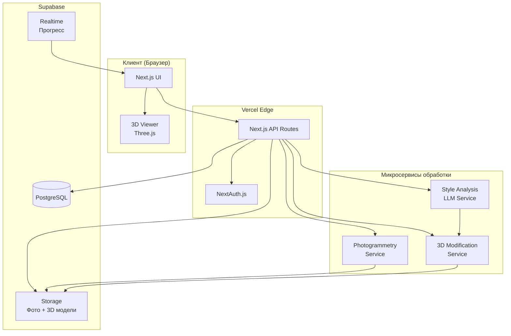

# Документ дизайна: Оцифровщик реальности в 3D

## Обзор

Система представляет собой веб-приложение для создания фотореалистичных 3D-копий объектов мебели и декора с возможностью их модификации. Архитектура построена на современном технологическом стеке с разделением на фронтенд (Next.js) и бэкенд (Supabase), что обеспечивает масштабируемость и производительность.

### Технологический стек

- **Фронтенд**: Next.js (TypeScript/TSX), Tailwind CSS, shadcn/ui
- **Пакетный менеджер**: Bun
- **Бэкенд**: Supabase (PostgreSQL)
- **Аутентификация**: NextAuth.js
- **Хостинг**: Vercel
- **3D-визуализация**: Three.js / React Three Fiber
- **Обработка 3D**: Python-микросервисы (фотограмметрия, Gaussian Splatting/NeRF)
- **LLM**: OpenAI API или аналог для анализа стиля и генерации предложений

### Ключевые принципы дизайна

1. **Модульность**: Разделение на независимые микросервисы для обработки 3D
2. **Асинхронность**: Длительные операции (сканирование, модификация) выполняются асинхронно
3. **Прогрессивная загрузка**: Пользователь видит прогресс обработки в реальном времени
4. **Оптимизация производительности**: Кэширование результатов, оптимизация 3D-моделей для веба

## Архитектура

### Общая архитектура системы



### Поток данных

1. **Загрузка фотографий**: Клиент → API → Storage → Scanner
2. **Создание 3D-модели**: Scanner → Storage → DB (метаданные)
3. **Анализ стиля**: API → LLM → DB (результаты анализа)
4. **Генерация предложений**: LLM → DB
5. **Применение модификации**: API → Modifier → Storage → DB
6. **Визуализация**: Storage → Клиент → Three.js Viewer

## Компоненты и интерфейсы

### Фронтенд компоненты

#### 1. ProjectDashboard
Главная страница со списком проектов пользователя.

```typescript
interface ProjectDashboardProps {
  userId: string;
}

interface Project {
  id: string;
  name: string;
  thumbnail: string;
  createdAt: Date;
  updatedAt: Date;
  status: 'scanning' | 'ready' | 'modifying' | 'error';
}
```

#### 2. PhotoUploader
Компонент для загрузки фотографий объекта.

```typescript
interface PhotoUploaderProps {
  projectId: string;
  onUploadComplete: (photoIds: string[]) => void;
  onError: (error: Error) => void;
}

interface UploadedPhoto {
  id: string;
  url: string;
  size: number;
  uploadedAt: Date;
}
```

#### 3. Model3DViewer
Компонент для отображения и взаимодействия с 3D-моделью.

```typescript
interface Model3DViewerProps {
  modelUrl: string;
  modelType: 'gaussian-splatting' | 'nerf';
  controls: boolean;
  onLoad: () => void;
  onError: (error: Error) => void;
}
```

#### 4. ModificationPanel
Панель для выбора и применения модификаций.

```typescript
interface ModificationPanelProps {
  projectId: string;
  currentModelId: string;
  suggestions: ModificationSuggestion[];
  onApplyModification: (modification: Modification) => void;
}

interface ModificationSuggestion {
  id: string;
  type: 'recolor' | 'restoration' | 'geometry';
  description: string;
  parameters: Record<string, any>;
  previewUrl?: string;
}
```

#### 5. ComparisonView
Компонент для сравнения версий модели.

```typescript
interface ComparisonViewProps {
  originalModelUrl: string;
  modifiedModelUrl: string;
  syncControls: boolean;
}
```

#### 6. MaterialSpecification
Отображение спецификаций материалов.

```typescript
interface MaterialSpecificationProps {
  specification: MaterialSpec;
}

interface MaterialSpec {
  id: string;
  modificationId: string;
  materials: Material[];
  instructions: string;
}

interface Material {
  name: string;
  type: 'paint' | 'fabric' | 'wood' | 'metal';
  color?: string;
  brand?: string;
  code?: string;
  quantity?: string;
}
```

### Бэкенд API

#### API Routes (Next.js)

```typescript
// /api/projects
POST   /api/projects              // Создать новый проект
GET    /api/projects              // Получить список проектов
GET    /api/projects/[id]         // Получить проект по ID
DELETE /api/projects/[id]         // Удалить проект

// /api/photos
POST   /api/projects/[id]/photos  // Загрузить фотографии
GET    /api/projects/[id]/photos  // Получить список фотографий

// /api/scan
POST   /api/projects/[id]/scan    // Запустить сканирование
GET    /api/projects/[id]/scan/status // Получить статус сканирования

// /api/models
GET    /api/projects/[id]/models  // Получить список моделей проекта
GET    /api/models/[id]           // Получить модель по ID

// /api/analysis
POST   /api/models/[id]/analyze   // Запустить анализ стиля
GET    /api/models/[id]/analysis  // Получить результаты анализа

// /api/modifications
GET    /api/models/[id]/suggestions // Получить предложения по модификации
POST   /api/models/[id]/modify    // Применить модификацию
GET    /api/modifications/[id]    // Получить информацию о модификации

// /api/specifications
GET    /api/modifications/[id]/spec // Получить спецификацию материалов
```

### Микросервисы

#### Photogrammetry Service

```python
# Интерфейс сервиса фотограмметрии
class PhotogrammetryService:
    def process_photos(
        self,
        project_id: str,
        photo_urls: List[str],
        output_format: Literal['gaussian-splatting', 'nerf']
    ) -> ProcessingJob:
        """Запускает обработку фотографий для создания 3D-модели"""
        pass
    
    def get_job_status(self, job_id: str) -> JobStatus:
        """Получает статус задачи обработки"""
        pass
    
    def get_model(self, job_id: str) -> Model3D:
        """Получает готовую 3D-модель"""
        pass
```

#### 3D Modification Service

```python
# Интерфейс сервиса модификации
class ModificationService:
    def apply_recolor(
        self,
        model_id: str,
        color_map: Dict[str, str]
    ) -> ModificationJob:
        """Применяет перекраску к модели"""
        pass
    
    def apply_restoration(
        self,
        model_id: str,
        damaged_regions: List[Region]
    ) -> ModificationJob:
        """Применяет реставрацию к поврежденным областям"""
        pass
    
    def apply_geometry_change(
        self,
        model_id: str,
        geometry_params: GeometryParams
    ) -> ModificationJob:
        """Применяет изменение геометрии"""
        pass
    
    def get_job_status(self, job_id: str) -> JobStatus:
        """Получает статус задачи модификации"""
        pass
```

#### Style Analysis LLM Service

```python
# Интерфейс LLM сервиса
class StyleAnalysisService:
    def analyze_style(
        self,
        model_id: str,
        images: List[str]
    ) -> StyleAnalysis:
        """Анализирует стиль объекта"""
        pass
    
    def generate_suggestions(
        self,
        style_analysis: StyleAnalysis,
        modification_types: List[str]
    ) -> List[ModificationSuggestion]:
        """Генерирует предложения по модификации"""
        pass
    
    def generate_material_spec(
        self,
        modification: Modification
    ) -> MaterialSpec:
        """Генерирует спецификацию материалов"""
        pass
```

## Модели данных

### База данных (PostgreSQL через Supabase)

```sql
-- Таблица пользователей (управляется NextAuth.js)
CREATE TABLE users (
    id UUID PRIMARY KEY DEFAULT uuid_generate_v4(),
    email VARCHAR(255) UNIQUE NOT NULL,
    name VARCHAR(255),
    created_at TIMESTAMP DEFAULT NOW(),
    updated_at TIMESTAMP DEFAULT NOW()
);

-- Таблица проектов
CREATE TABLE projects (
    id UUID PRIMARY KEY DEFAULT uuid_generate_v4(),
    user_id UUID REFERENCES users(id) ON DELETE CASCADE,
    name VARCHAR(255) NOT NULL,
    description TEXT,
    thumbnail_url TEXT,
    status VARCHAR(50) DEFAULT 'created',
    created_at TIMESTAMP DEFAULT NOW(),
    updated_at TIMESTAMP DEFAULT NOW()
);

-- Таблица фотографий
CREATE TABLE photos (
    id UUID PRIMARY KEY DEFAULT uuid_generate_v4(),
    project_id UUID REFERENCES projects(id) ON DELETE CASCADE,
    storage_path TEXT NOT NULL,
    url TEXT NOT NULL,
    size_bytes INTEGER,
    uploaded_at TIMESTAMP DEFAULT NOW()
);

-- Таблица 3D-моделей
CREATE TABLE models_3d (
    id UUID PRIMARY KEY DEFAULT uuid_generate_v4(),
    project_id UUID REFERENCES projects(id) ON DELETE CASCADE,
    parent_model_id UUID REFERENCES models_3d(id) ON DELETE SET NULL,
    model_type VARCHAR(50) NOT NULL, -- 'gaussian-splatting' или 'nerf'
    storage_path TEXT NOT NULL,
    url TEXT NOT NULL,
    is_original BOOLEAN DEFAULT TRUE,
    processing_job_id VARCHAR(255),
    created_at TIMESTAMP DEFAULT NOW()
);

-- Таблица анализа стиля
CREATE TABLE style_analyses (
    id UUID PRIMARY KEY DEFAULT uuid_generate_v4(),
    model_id UUID REFERENCES models_3d(id) ON DELETE CASCADE,
    style_description TEXT,
    dominant_colors JSONB,
    materials JSONB,
    style_tags TEXT[],
    analyzed_at TIMESTAMP DEFAULT NOW()
);

-- Таблица предложений по модификации
CREATE TABLE modification_suggestions (
    id UUID PRIMARY KEY DEFAULT uuid_generate_v4(),
    model_id UUID REFERENCES models_3d(id) ON DELETE CASCADE,
    modification_type VARCHAR(50) NOT NULL,
    description TEXT NOT NULL,
    parameters JSONB NOT NULL,
    preview_url TEXT,
    created_at TIMESTAMP DEFAULT NOW()
);

-- Таблица модификаций
CREATE TABLE modifications (
    id UUID PRIMARY KEY DEFAULT uuid_generate_v4(),
    original_model_id UUID REFERENCES models_3d(id) ON DELETE CASCADE,
    modified_model_id UUID REFERENCES models_3d(id) ON DELETE CASCADE,
    modification_type VARCHAR(50) NOT NULL,
    parameters JSONB NOT NULL,
    status VARCHAR(50) DEFAULT 'pending',
    processing_job_id VARCHAR(255),
    created_at TIMESTAMP DEFAULT NOW(),
    completed_at TIMESTAMP
);

-- Таблица спецификаций материалов
CREATE TABLE material_specifications (
    id UUID PRIMARY KEY DEFAULT uuid_generate_v4(),
    modification_id UUID REFERENCES modifications(id) ON DELETE CASCADE,
    materials JSONB NOT NULL,
    instructions TEXT,
    created_at TIMESTAMP DEFAULT NOW()
);

-- Таблица задач обработки (для отслеживания прогресса)
CREATE TABLE processing_jobs (
    id VARCHAR(255) PRIMARY KEY,
    job_type VARCHAR(50) NOT NULL, -- 'scan', 'modify'
    project_id UUID REFERENCES projects(id) ON DELETE CASCADE,
    status VARCHAR(50) DEFAULT 'pending',
    progress INTEGER DEFAULT 0,
    error_message TEXT,
    started_at TIMESTAMP,
    completed_at TIMESTAMP,
    created_at TIMESTAMP DEFAULT NOW()
);

-- Индексы для производительности
CREATE INDEX idx_projects_user_id ON projects(user_id);
CREATE INDEX idx_photos_project_id ON photos(project_id);
CREATE INDEX idx_models_project_id ON models_3d(project_id);
CREATE INDEX idx_modifications_original_model ON modifications(original_model_id);
CREATE INDEX idx_processing_jobs_status ON processing_jobs(status);
```

### TypeScript типы (фронтенд)

```typescript
// Типы для проектов
type ProjectStatus = 'created' | 'uploading' | 'scanning' | 'ready' | 'modifying' | 'error';

interface Project {
  id: string;
  userId: string;
  name: string;
  description?: string;
  thumbnailUrl?: string;
  status: ProjectStatus;
  createdAt: Date;
  updatedAt: Date;
}

// Типы для 3D-моделей
type ModelType = 'gaussian-splatting' | 'nerf';

interface Model3D {
  id: string;
  projectId: string;
  parentModelId?: string;
  modelType: ModelType;
  storagePath: string;
  url: string;
  isOriginal: boolean;
  processingJobId?: string;
  createdAt: Date;
}

// Типы для анализа стиля
interface StyleAnalysis {
  id: string;
  modelId: string;
  styleDescription: string;
  dominantColors: string[];
  materials: string[];
  styleTags: string[];
  analyzedAt: Date;
}

// Типы для модификаций
type ModificationType = 'recolor' | 'restoration' | 'geometry';
type ModificationStatus = 'pending' | 'processing' | 'completed' | 'failed';

interface Modification {
  id: string;
  originalModelId: string;
  modifiedModelId?: string;
  modificationType: ModificationType;
  parameters: Record<string, any>;
  status: ModificationStatus;
  processingJobId?: string;
  createdAt: Date;
  completedAt?: Date;
}

// Типы для задач обработки
type JobType = 'scan' | 'modify';
type JobStatus = 'pending' | 'processing' | 'completed' | 'failed';

interface ProcessingJob {
  id: string;
  jobType: JobType;
  projectId: string;
  status: JobStatus;
  progress: number;
  errorMessage?: string;
  startedAt?: Date;
  completedAt?: Date;
  createdAt: Date;
}
```


## Свойства корректности

Свойство — это характеристика или поведение, которое должно выполняться во всех валидных сценариях работы системы. По сути, это формальное утверждение о том, что система должна делать. Свойства служат мостом между человекочитаемыми спецификациями и машинно-проверяемыми гарантиями корректности.

### Свойство 1: Сканирование создаёт модель корректного формата

*Для любого* валидного набора фотографий объекта, после успешного завершения сканирования должна быть создана 3D-модель в формате Gaussian Splatting или NeRF.

**Проверяет: Требования 1.1, 1.2**

### Свойство 2: Сканирование сохраняет модель в хранилище

*Для любого* успешно завершённого сканирования, созданная 3D-модель должна быть доступна в хранилище и иметь корректные метаданные в базе данных.

**Проверяет: Требования 1.5**

### Свойство 3: Обработка ошибок при некачественных фотографиях

*Для любого* набора фотографий с недостаточным качеством, система должна вернуть сообщение об ошибке, содержащее конкретные рекомендации по улучшению.

**Проверяет: Требования 1.4, 9.1**

### Свойство 4: Анализ стиля возвращает полную структуру

*Для любой* валидной 3D-модели, результат анализа стиля должен содержать все обязательные поля: текстовое описание стиля, список материалов и цветовую палитру.

**Проверяет: Требования 2.1, 2.2, 2.3**

### Свойство 5: Генерация всех типов предложений по модификации

*Для любого* завершённого анализа стиля, система должна сгенерировать предложения всех трёх типов: перекраска, реставрация и изменение геометрии.

**Проверяет: Требования 3.1, 3.2, 3.3, 3.4**

### Свойство 6: Модификация создаёт новую версию модели

*Для любой* применённой модификации (перекраска, реставрация или изменение геометрии), система должна создать новую версию 3D-модели, сохранив исходную без изменений.

**Проверяет: Требования 4.1, 4.2, 4.3, 4.4, 4.5**

### Свойство 7: Синхронизация камер при сравнении версий

*Для любых* двух версий модели в режиме сравнения, изменение угла обзора или масштаба в одном viewer должно автоматически применяться ко второму viewer.

**Проверяет: Требования 6.3, 6.4**

### Свойство 8: Генерация спецификации материалов с конкретными названиями

*Для любой* выбранной модификации, сгенерированная спецификация материалов должна содержать конкретные названия материалов (краски, ткани и т.д.) и рекомендации по применению.

**Проверяет: Требования 7.1, 7.2, 7.4**

### Свойство 9: Сохранение проекта с полными данными

*Для любого* создаваемого проекта, после сохранения все связанные данные (метаданные проекта, фотографии, модели) должны быть доступны при последующей загрузке.

**Проверяет: Требования 8.1, 8.3**

### Свойство 10: Каскадное удаление данных проекта

*Для любого* удаляемого проекта, все связанные данные (3D-модели, фотографии, анализы, модификации) должны быть полностью удалены из системы.

**Проверяет: Требования 8.4, 8.5**

### Свойство 11: Список проектов пользователя

*Для любого* пользователя, запрос списка проектов должен возвращать все и только те проекты, которые принадлежат этому пользователю.

**Проверяет: Требования 8.2**

### Свойство 12: Обработка ошибок с объяснениями

*Для любой* ошибки (сканирование, модификация, сетевая), система должна предоставить понятное сообщение с объяснением причины и, где применимо, предложением повторить операцию.

**Проверяет: Требования 9.2, 9.3**

### Свойство 13: Логирование всех ошибок

*Для любой* возникшей ошибки в системе, должна быть создана запись в логах с полной информацией для технической поддержки.

**Проверяет: Требования 9.4**

### Свойство 14: Сохранение состояния при критических ошибках

*Для любой* критической ошибки, текущее состояние проекта должно быть сохранено, и данные не должны быть потеряны.

**Проверяет: Требования 9.5**

### Свойство 15: Время начала обработки фотографий

*Для любой* загрузки фотографий, система должна начать обработку в течение 5 секунд после завершения загрузки.

**Проверяет: Требования 10.1**

### Свойство 16: Время создания 3D-модели

*Для любого* среднего объекта (мебель, декор), процесс сканирования должен завершиться в течение 10 минут.

**Проверяет: Требования 10.2**

### Свойство 17: Время применения модификации

*Для любой* модификации (перекраска, реставрация, изменение геометрии), обновление модели должно завершиться в течение 2 минут.

**Проверяет: Требования 10.3**

### Свойство 18: Производительность визуализации

*Для любой* 3D-модели на современном устройстве, визуализатор должен обеспечивать плавный рендеринг с частотой не менее 30 FPS.

**Проверяет: Требования 10.4**

### Свойство 19: Интерактивность визуализатора

*Для любого* взаимодействия пользователя с моделью (вращение, масштабирование, панорамирование), состояние камеры должно корректно обновляться в соответствии с действием.

**Проверяет: Требования 5.2**

## Обработка ошибок

### Стратегия обработки ошибок

Система использует многоуровневый подход к обработке ошибок:

1. **Валидация на клиенте**: Проверка данных перед отправкой на сервер
2. **Валидация на сервере**: Повторная проверка всех входных данных
3. **Обработка ошибок микросервисов**: Retry-логика и graceful degradation
4. **Логирование**: Централизованное логирование всех ошибок
5. **Уведомления пользователя**: Понятные сообщения об ошибках

### Типы ошибок и их обработка

#### Ошибки загрузки фотографий

```typescript
interface PhotoUploadError {
  type: 'invalid_format' | 'file_too_large' | 'insufficient_quality' | 'network_error';
  message: string;
  recommendations?: string[];
}

// Пример обработки
try {
  await uploadPhotos(files);
} catch (error) {
  if (error.type === 'insufficient_quality') {
    showError({
      title: 'Недостаточное качество фотографий',
      message: error.message,
      recommendations: [
        'Используйте фотографии с разрешением не менее 1920x1080',
        'Обеспечьте хорошее освещение объекта',
        'Сделайте фотографии с разных ракурсов (минимум 20 снимков)'
      ]
    });
  }
}
```

#### Ошибки сканирования

```typescript
interface ScanningError {
  type: 'processing_failed' | 'timeout' | 'insufficient_photos' | 'object_not_recognized';
  message: string;
  jobId: string;
  recommendations?: string[];
}

// Retry-логика для временных ошибок
async function scanWithRetry(projectId: string, maxRetries = 3) {
  for (let attempt = 1; attempt <= maxRetries; attempt++) {
    try {
      return await startScanning(projectId);
    } catch (error) {
      if (error.type === 'timeout' && attempt < maxRetries) {
        await delay(1000 * attempt); // Exponential backoff
        continue;
      }
      throw error;
    }
  }
}
```

#### Ошибки модификации

```typescript
interface ModificationError {
  type: 'invalid_parameters' | 'model_not_found' | 'processing_failed';
  message: string;
  modelId: string;
}

// Валидация параметров модификации
function validateModificationParams(
  type: ModificationType,
  params: Record<string, any>
): ValidationResult {
  switch (type) {
    case 'recolor':
      if (!params.colorMap || Object.keys(params.colorMap).length === 0) {
        return { valid: false, error: 'Необходимо указать хотя бы один цвет для перекраски' };
      }
      break;
    case 'restoration':
      if (!params.damagedRegions || params.damagedRegions.length === 0) {
        return { valid: false, error: 'Необходимо указать области для реставрации' };
      }
      break;
    case 'geometry':
      if (!params.geometryParams) {
        return { valid: false, error: 'Необходимо указать параметры изменения геометрии' };
      }
      break;
  }
  return { valid: true };
}
```

#### Сетевые ошибки

```typescript
// Обёртка для API-запросов с обработкой сетевых ошибок
async function apiRequest<T>(
  url: string,
  options: RequestInit
): Promise<T> {
  try {
    const response = await fetch(url, {
      ...options,
      signal: AbortSignal.timeout(30000) // 30 секунд таймаут
    });
    
    if (!response.ok) {
      throw new ApiError(response.status, await response.text());
    }
    
    return await response.json();
  } catch (error) {
    if (error instanceof TypeError) {
      // Сетевая ошибка
      throw new NetworkError('Проблема с подключением. Проверьте интернет-соединение и повторите попытку.');
    }
    throw error;
  }
}
```

#### Критические ошибки

```typescript
// Сохранение состояния при критических ошибках
window.addEventListener('error', async (event) => {
  try {
    // Логирование ошибки
    await logError({
      type: 'critical',
      message: event.message,
      stack: event.error?.stack,
      timestamp: new Date().toISOString()
    });
    
    // Сохранение текущего состояния проекта
    const currentProject = getCurrentProject();
    if (currentProject) {
      await saveProjectState(currentProject);
    }
  } catch (saveError) {
    console.error('Failed to save project state:', saveError);
  }
});
```

### Логирование

```typescript
// Централизованная система логирования
interface LogEntry {
  level: 'info' | 'warning' | 'error' | 'critical';
  message: string;
  context?: Record<string, any>;
  timestamp: string;
  userId?: string;
  projectId?: string;
  stackTrace?: string;
}

async function logError(entry: Omit<LogEntry, 'timestamp'>) {
  const logEntry: LogEntry = {
    ...entry,
    timestamp: new Date().toISOString()
  };
  
  // Отправка в систему логирования (например, Sentry, LogRocket)
  await sendToLoggingService(logEntry);
  
  // Сохранение в локальное хранилище для отладки
  if (process.env.NODE_ENV === 'development') {
    console.error(logEntry);
  }
}
```

## Стратегия тестирования

### Двойной подход к тестированию

Система использует комбинацию unit-тестов и property-based тестов для обеспечения комплексного покрытия:

- **Unit-тесты**: Проверяют конкретные примеры, граничные случаи и условия ошибок
- **Property-тесты**: Проверяют универсальные свойства на множестве сгенерированных входных данных

Оба подхода дополняют друг друга: unit-тесты выявляют конкретные баги, а property-тесты проверяют общую корректность.

### Баланс unit-тестирования

Unit-тесты полезны для конкретных примеров и граничных случаев, но не следует писать их слишком много — property-based тесты покрывают множество входных данных. Unit-тесты должны фокусироваться на:

- Конкретных примерах, демонстрирующих корректное поведение
- Точках интеграции между компонентами
- Граничных случаях и условиях ошибок

Property-тесты должны фокусироваться на:

- Универсальных свойствах, которые выполняются для всех входных данных
- Комплексном покрытии входных данных через рандомизацию

### Конфигурация property-based тестов

- Минимум 100 итераций на каждый property-тест (из-за рандомизации)
- Каждый property-тест должен ссылаться на свойство из документа дизайна
- Формат тега: **Feature: reality-digitizer-3d, Property {номер}: {текст свойства}**
- Каждое свойство корректности должно быть реализовано ОДНИМ property-based тестом

### Библиотека для property-based тестирования

Для TypeScript/JavaScript используем **fast-check** — зрелую библиотеку для property-based тестирования.

```typescript
import fc from 'fast-check';

// Пример property-теста
describe('Feature: reality-digitizer-3d, Property 2: Сканирование сохраняет модель в хранилище', () => {
  it('should save model to storage after successful scan', async () => {
    await fc.assert(
      fc.asyncProperty(
        fc.array(fc.string(), { minLength: 10, maxLength: 50 }), // Генерация массива URL фотографий
        async (photoUrls) => {
          // Arrange
          const projectId = await createTestProject();
          await uploadPhotos(projectId, photoUrls);
          
          // Act
          const scanResult = await startScanning(projectId);
          await waitForCompletion(scanResult.jobId);
          
          // Assert
          const model = await getModel(scanResult.modelId);
          expect(model).toBeDefined();
          expect(model.url).toBeTruthy();
          expect(model.projectId).toBe(projectId);
          
          // Проверка наличия в хранилище
          const storageExists = await checkStorageExists(model.storagePath);
          expect(storageExists).toBe(true);
        }
      ),
      { numRuns: 100 }
    );
  });
});
```

### Тестовые уровни

#### 1. Unit-тесты (Jest + React Testing Library)

Тестирование отдельных компонентов и функций:

```typescript
// Пример unit-теста для компонента
describe('PhotoUploader', () => {
  it('should show error for files exceeding size limit', async () => {
    const onError = jest.fn();
    render(<PhotoUploader projectId="test" onError={onError} />);
    
    const largeFile = new File(['x'.repeat(11 * 1024 * 1024)], 'large.jpg', { type: 'image/jpeg' });
    const input = screen.getByLabelText('Upload photos');
    
    await userEvent.upload(input, largeFile);
    
    expect(onError).toHaveBeenCalledWith(
      expect.objectContaining({
        type: 'file_too_large'
      })
    );
  });
});
```

#### 2. Property-based тесты (fast-check)

Тестирование универсальных свойств:

```typescript
// Пример property-теста для модификации
describe('Feature: reality-digitizer-3d, Property 6: Модификация создаёт новую версию модели', () => {
  it('should create new model version while preserving original', async () => {
    await fc.assert(
      fc.asyncProperty(
        fc.record({
          modelId: fc.uuid(),
          modificationType: fc.constantFrom('recolor', 'restoration', 'geometry'),
          parameters: fc.object()
        }),
        async ({ modelId, modificationType, parameters }) => {
          // Arrange
          const originalModel = await getModel(modelId);
          const originalData = await fetchModelData(originalModel.url);
          
          // Act
          const modification = await applyModification(modelId, modificationType, parameters);
          await waitForCompletion(modification.processingJobId);
          
          // Assert
          const modifiedModel = await getModel(modification.modifiedModelId);
          const originalModelAfter = await getModel(modelId);
          const originalDataAfter = await fetchModelData(originalModelAfter.url);
          
          // Новая модель создана
          expect(modifiedModel.id).not.toBe(originalModel.id);
          expect(modifiedModel.parentModelId).toBe(originalModel.id);
          
          // Исходная модель не изменилась
          expect(originalModelAfter).toEqual(originalModel);
          expect(originalDataAfter).toEqual(originalData);
        }
      ),
      { numRuns: 100 }
    );
  });
});
```

#### 3. Интеграционные тесты

Тестирование взаимодействия между компонентами:

```typescript
describe('End-to-end scanning workflow', () => {
  it('should complete full scanning workflow', async () => {
    // Создание проекта
    const project = await createProject({ name: 'Test Project' });
    
    // Загрузка фотографий
    const photos = await uploadPhotos(project.id, testPhotoFiles);
    expect(photos).toHaveLength(testPhotoFiles.length);
    
    // Запуск сканирования
    const scanJob = await startScanning(project.id);
    expect(scanJob.status).toBe('pending');
    
    // Ожидание завершения
    const completedJob = await waitForCompletion(scanJob.id, { timeout: 600000 });
    expect(completedJob.status).toBe('completed');
    
    // Проверка созданной модели
    const models = await getProjectModels(project.id);
    expect(models).toHaveLength(1);
    expect(models[0].isOriginal).toBe(true);
    expect(models[0].modelType).toMatch(/gaussian-splatting|nerf/);
  });
});
```

#### 4. E2E тесты (Playwright)

Тестирование пользовательских сценариев в браузере:

```typescript
import { test, expect } from '@playwright/test';

test('user can create project and upload photos', async ({ page }) => {
  await page.goto('/');
  
  // Вход в систему
  await page.click('text=Sign In');
  await page.fill('input[name="email"]', 'test@example.com');
  await page.fill('input[name="password"]', 'password');
  await page.click('button[type="submit"]');
  
  // Создание проекта
  await page.click('text=New Project');
  await page.fill('input[name="name"]', 'My Chair');
  await page.click('button:has-text("Create")');
  
  // Загрузка фотографий
  await page.setInputFiles('input[type="file"]', testPhotoFiles);
  await expect(page.locator('.photo-thumbnail')).toHaveCount(testPhotoFiles.length);
  
  // Запуск сканирования
  await page.click('button:has-text("Start Scanning")');
  await expect(page.locator('.progress-indicator')).toBeVisible();
});
```

### Тестирование микросервисов

#### Python-микросервисы (pytest + hypothesis)

```python
from hypothesis import given, strategies as st
import pytest

# Property-тест для фотограмметрии
@given(
    photo_urls=st.lists(st.text(), min_size=10, max_size=50),
    output_format=st.sampled_from(['gaussian-splatting', 'nerf'])
)
def test_photogrammetry_creates_valid_model(photo_urls, output_format):
    """
    Feature: reality-digitizer-3d, Property 1: Сканирование создаёт модель корректного формата
    """
    # Arrange
    service = PhotogrammetryService()
    
    # Act
    job = service.process_photos(
        project_id='test-project',
        photo_urls=photo_urls,
        output_format=output_format
    )
    
    # Wait for completion
    result = wait_for_job(job.id, timeout=600)
    
    # Assert
    assert result.status == 'completed'
    model = service.get_model(job.id)
    assert model.format == output_format
    assert model.file_path.exists()
```

### Покрытие кода

Целевые показатели покрытия:

- **Общее покрытие**: минимум 80%
- **Критические пути** (сканирование, модификация): минимум 95%
- **Обработка ошибок**: минимум 90%
- **UI-компоненты**: минимум 70%

### CI/CD Pipeline

```yaml
# .github/workflows/test.yml
name: Test Suite

on: [push, pull_request]

jobs:
  test:
    runs-on: ubuntu-latest
    steps:
      - uses: actions/checkout@v3
      
      - name: Setup Node.js
        uses: actions/setup-node@v3
        with:
          node-version: '18'
      
      - name: Install dependencies
        run: npm ci
      
      - name: Run unit tests
        run: npm run test:unit
      
      - name: Run property tests
        run: npm run test:property
      
      - name: Run integration tests
        run: npm run test:integration
      
      - name: Upload coverage
        uses: codecov/codecov-action@v3
        with:
          files: ./coverage/coverage-final.json
```

### Мониторинг в продакшене

- **Error tracking**: Sentry для отслеживания ошибок в реальном времени
- **Performance monitoring**: Vercel Analytics для мониторинга производительности
- **User session replay**: LogRocket для воспроизведения пользовательских сессий с ошибками
- **Synthetic monitoring**: Периодические проверки критических путей

