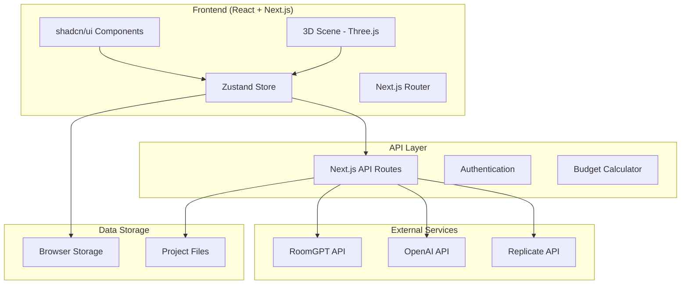

# Дизайн архитектуры: Создатель Уютных Комнат

## Обзор

Веб-приложение построено на современном стеке технологий с акцентом на производительность 3D-рендеринга и интеграцию с ИИ-сервисами. Архитектура следует принципам модульности и разделения ответственности.

## Технологический стек

### Frontend
- **React 18** с TypeScript для основной логики
- **Next.js 14** для SSR и оптимизации
- **shadcn/ui** для UI компонентов
- **Tailwind CSS** для стилизации
- **Three.js** для 3D-визуализации
- **React Three Fiber** для интеграции Three.js с React
- **Zustand** для управления состоянием

### Backend/API
- **Next.js API Routes** для серверной логики
- **RoomGPT API** для ИИ-рекомендаций
- **Prisma** для работы с базой данных (если потребуется)
- **Vercel** для деплоя

### Внешние сервисы
- **RoomGPT API** - анализ и генерация рекомендаций
- **OpenAI API** - дополнительные ИИ-возможности
- **Replicate API** - генерация изображений интерьера

## Архитектура системы



## Компоненты и интерфейсы

### Основные компоненты

#### 1. RoomCanvas (3D Scene)
```typescript
interface RoomCanvasProps {
  roomDimensions: RoomDimensions;
  furniture: FurnitureItem[];
  onItemSelect: (item: FurnitureItem) => void;
  onItemMove: (itemId: string, position: Vector3) => void;
}
```

#### 2. BudgetPanel
```typescript
interface BudgetPanelProps {
  totalBudget: number;
  spentAmount: number;
  warningThreshold: number;
  onBudgetChange: (newBudget: number) => void;
}
```

#### 3. FurnitureLibrary
```typescript
interface FurnitureLibraryProps {
  categories: FurnitureCategory[];
  selectedCategory: string;
  onCategoryChange: (category: string) => void;
  onItemAdd: (item: FurnitureItem) => void;
}
```

#### 4. AIRecommendations
```typescript
interface AIRecommendationsProps {
  roomStyle: RoomStyle;
  currentBudget: number;
  existingFurniture: FurnitureItem[];
  onRecommendationSelect: (item: FurnitureItem) => void;
}
```

### Интерфейсы данных

#### RoomDimensions
```typescript
interface RoomDimensions {
  width: number;
  height: number;
  depth: number;
}
```

#### FurnitureItem
```typescript
interface FurnitureItem {
  id: string;
  name: string;
  category: FurnitureCategory;
  price: number;
  dimensions: {
    width: number;
    height: number;
    depth: number;
  };
  position: Vector3;
  rotation: Vector3;
  modelUrl: string;
  thumbnailUrl: string;
  style: RoomStyle[];
  color: string;
}
```

#### RoomProject
```typescript
interface RoomProject {
  id: string;
  name: string;
  roomDimensions: RoomDimensions;
  furniture: FurnitureItem[];
  budget: number;
  style: RoomStyle;
  createdAt: Date;
  updatedAt: Date;
}
```

## Модели данных

### Категории мебели
```typescript
enum FurnitureCategory {
  FURNITURE = 'furniture',
  TEXTILE = 'textile', 
  DECOR = 'decor',
  LIGHTING = 'lighting',
  PLANTS = 'plants',
  APPLIANCES = 'appliances'
}
```

### Стили интерьера
```typescript
enum RoomStyle {
  SCANDINAVIAN = 'scandinavian',
  LOFT = 'loft',
  CLASSIC = 'classic',
  MODERN = 'modern',
  MINIMALIST = 'minimalist'
}
```

### Состояние приложения (Zustand Store)
```typescript
interface AppState {
  // Room state
  currentProject: RoomProject | null;
  roomDimensions: RoomDimensions;
  
  // Furniture state
  furniture: FurnitureItem[];
  selectedItem: FurnitureItem | null;
  
  // Budget state
  budget: number;
  spentAmount: number;
  
  // UI state
  selectedCategory: FurnitureCategory;
  selectedStyle: RoomStyle;
  isLoading: boolean;
  
  // Actions
  setRoomDimensions: (dimensions: RoomDimensions) => void;
  addFurniture: (item: FurnitureItem) => void;
  removeFurniture: (itemId: string) => void;
  updateFurniture: (itemId: string, updates: Partial<FurnitureItem>) => void;
  setBudget: (budget: number) => void;
  saveProject: () => void;
  loadProject: (project: RoomProject) => void;
}
```

## Интеграция с RoomGPT API

### AI Service Layer
```typescript
class AIRecommendationService {
  private roomGPTClient: RoomGPTClient;
  
  async getStyleRecommendations(
    style: RoomStyle,
    budget: number,
    roomDimensions: RoomDimensions
  ): Promise<FurnitureItem[]> {
    // Интеграция с RoomGPT API
  }
  
  async analyzeBudgetOptimization(
    currentFurniture: FurnitureItem[],
    targetBudget: number
  ): Promise<OptimizationSuggestion[]> {
    // Анализ бюджета и предложения замен
  }
  
  async generateRoomLayout(
    roomDimensions: RoomDimensions,
    style: RoomStyle
  ): Promise<LayoutSuggestion> {
    // Генерация оптимальной расстановки
  }
}
```

## Обработка ошибок

### Error Boundary компоненты
- **3DSceneErrorBoundary** - для ошибок Three.js
- **APIErrorBoundary** - для ошибок внешних API
- **GlobalErrorBoundary** - общий обработчик ошибок

### Стратегии обработки ошибок
1. **Graceful degradation** - приложение работает без ИИ при недоступности API
2. **Retry механизмы** - автоматические повторы запросов
3. **Fallback UI** - запасные интерфейсы при ошибках
4. **User feedback** - понятные сообщения об ошибках

## Стратегия тестирования

### Unit тесты
- Тестирование бизнес-логики (бюджет, расчеты)
- Тестирование утилитарных функций
- Тестирование Zustand store

### Integration тесты
- Тестирование API интеграций
- Тестирование 3D сцены
- Тестирование пользовательских сценариев

### E2E тесты
- Полный цикл создания комнаты
- Тестирование экспорта/импорта проектов
- Тестирование бюджетных ограничений

### Инструменты тестирования
- **Jest** для unit тестов
- **React Testing Library** для компонентов
- **Playwright** для E2E тестов
- **MSW** для мокирования API

## Производительность и оптимизация

### 3D оптимизация
- **LOD (Level of Detail)** для 3D моделей
- **Frustum culling** - рендер только видимых объектов
- **Instancing** для повторяющихся объектов
- **Texture compression** для быстрой загрузки

### Загрузка данных
- **Lazy loading** компонентов и 3D моделей
- **Progressive loading** - поэтапная загрузка деталей
- **Caching** API ответов и 3D ресурсов
- **Preloading** популярных предметов мебели

### Bundle оптимизация
- **Code splitting** по маршрутам и компонентам
- **Tree shaking** неиспользуемого кода
- **Dynamic imports** для тяжелых библиотек
- **Service Worker** для кеширования ресурсов

## Безопасность

### API безопасность
- **Rate limiting** для внешних API
- **API key management** через переменные окружения
- **Input validation** всех пользовательских данных
- **CORS настройки** для безопасных запросов

### Клиентская безопасность
- **XSS защита** через санитизацию данных
- **Content Security Policy** заголовки
- **Secure storage** чувствительных данных
- **HTTPS only** для продакшена